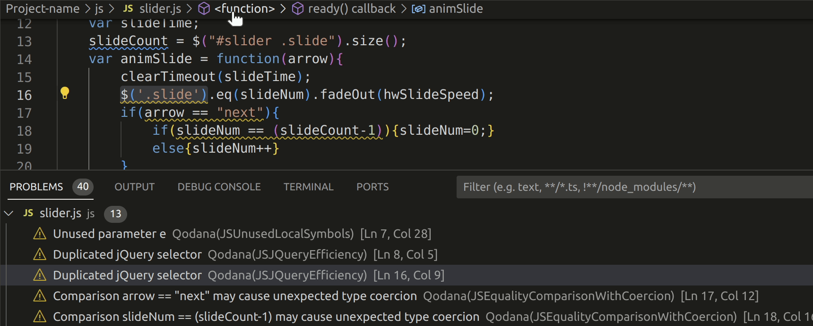
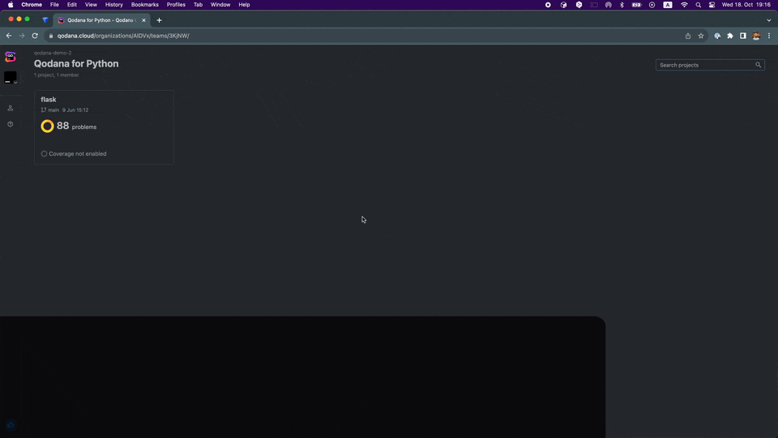
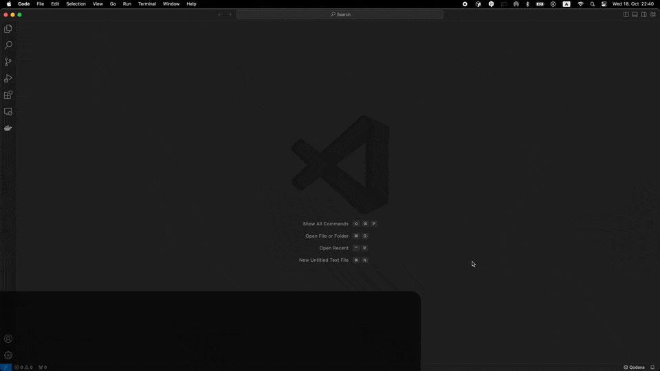
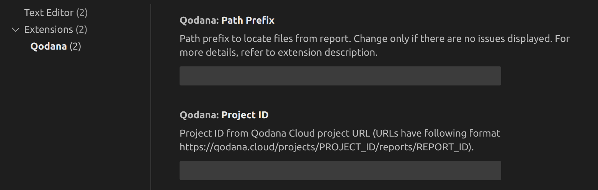
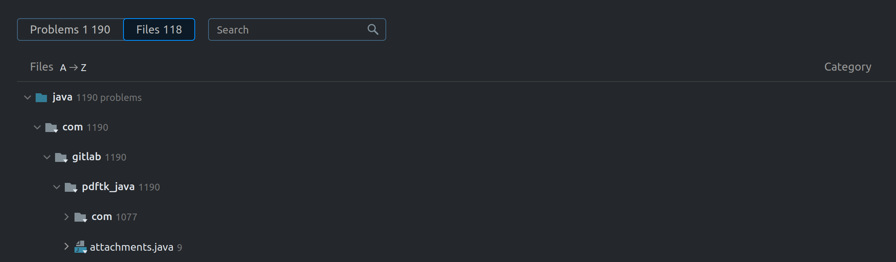

# Qodana extension for Visual Studio Code

The Qodana extension shows inspection reports generated by Qodana after running in CI/CD pipelines to let you fix the existing 
problems detected in your project codebase. It connects and synchronizes your project with 
Qodana reports uploaded to [Qodana Cloud](https://qodana.cloud), and showcases the latest code quality problems detected in 
your project. You can overview them directly in the editor, or toggle the **PROBLEMS** tab to see them in the form of list. 

## Requirements

To use the extension, you need to run Visual Studio Code version 1.81 and later. 

Also, ensure you fulfill the following prerequisites:

1. You have a Qodana Cloud account and a project in it. If necessary, navigate to [Qodana Cloud](https://qodana.cloud/) and accomplish these steps.
2. You have run Qodana over your project at least once, and the generated report has been uploaded to your Qodana Cloud project.
3. The source code of this project has been was opened in a VS Code workspace
4. There is a Java binary on your system path (JRE 11 or higher is required). You can check it by running the command "java -version" in the Terminal.

## Prepare your project

1. In your Visual Studio Code, open your project as a Workspace.
2. In your browser, open [Qodana Cloud](https://qodana.cloud) and navigate to your project.
3. In Qodana Cloud, click the **Open file in Visual Studio Code** button from the dropdown selector under any issue found in the project.
4. In lower-right corner of the Visual Studio Code UI, follow the Qodana Cloud login instructions. 
5. In Qodana Cloud, navigate to the project report and click **Open file in Visual Studio Code**.
6. Overview Qodana reports in your Visual Studio Code. 

Alternatively:

1. In Visual Studio Code, navigate to the **Settings** page and find the **Qodana** configuration settings.
2. On the **Settings** page, in the **Project ID** field enter the Qodana Cloud project ID. To locate this ID, open your project in Qodana Cloud; the URL will have the following format: `https://qodana.cloud/projects/PROJECT_ID/reports/REPORT_ID`.

3. Follow the instructions to log in to Qodana Cloud.

### Troubleshooting

If you can't still overview a report, on the **Settings** page adjust the **Path Prefix** value.

The basic rule is: `Full Path = Workspace + Path Prefix + Path in SARIF`

Here are examples how to define the correct path prefix:

| Full Path         | Path in SARIF | Workspace    | Path Prefix       |
|-------------------|---------------|--------------|-------------------|
| /foo/bar/baz/file | baz/file      | /foo/bar     | (empty, no value) |
| /foo/bar/baz/file | baz/file      | /foo/bar/baz | ..                |
| /foo/bar/baz/file | file          | /foo/bar     | baz               |

To see how the `Path in SARIF` is set in the project, in Qodana Cloud navigate to the **Files** section located beneath the sunburst diagram.

> Feel free to commit `.vscode/settings.json` in your repository to share the Qodana integration settings with your team!

## Clear settings

To disconnect from Qodana Cloud, in Visual Studio Code use the `Qodana: Reset authentication` command.

To reset the extension settings, in Visual Studio Code use the `Qodana: Reset settings` command.

To temporarily disable the extension, in the status bar click **Qodana**.

## Data and telemetry

The Qodana extension for Visual Studio Code is enhanced with telemetry functionality aimed at collecting valuable data on how you use the extension. Importantly, no project-specific or personal data is collected as part of this telemetry. The items logged, which exclusively use predefined string literals, include the following events:

- **Extension Start and Stop**

- **Opening the Report from Qodana Cloud**

- **Opening a File Using URL from Qodana Cloud**

- **Settings Reset**

- **Turning Off/On Displaying the Issues from Qodana Cloud**

- **Predefined Error Messages**

The telemetry information increases the efficiency of the extension by availing usage data for improvements. Logging is performed using the recommended API by the [extension authors guide](https://code.visualstudio.com/api/extension-guides/telemetry).

Respecting your privacy, we provide the option to opt-out of telemetry data collection. You can revoke consent by uninstalling the Qodana Cloud VS Code extension or switching the `telemetry.telemetryLevel` setting in Visual Studio Code to *off*.

This information helps us understand your needs better to enhance the functionality and user experience of the Qodana extension for Visual Studio Code while keeping your data private and secure. Your feedback is always appreciated!

## Questions, issues, or feedback?

All issues, feature requests, and support inquiries related to Qodana are managed at: [YouTrack][youtrack].

To file a new issue, please follow this link: [YouTrack | New Issue][youtrack-new-issue]. Additionally, you can use [GitHub Discussions][jb:discussions] to pose questions or provide feedback.

[gh:qodana]: https://github.com/JetBrains/qodana-action/actions/workflows/code_scanning.yml
[youtrack]: https://youtrack.jetbrains.com/issues/QD
[youtrack-new-issue]: https://youtrack.jetbrains.com/newIssue?project=QD&c=Platform%20GitHub%20action
[jb:confluence-on-gh]: https://confluence.jetbrains.com/display/ALL/JetBrains+on+GitHub
[jb:discussions]: https://jb.gg/qodana-discussions
[jb:twitter]: https://twitter.com/Qodana
[jb:docker]: https://hub.docker.com/r/jetbrains/qodana

## License

Copyright © 2000-2023 JetBrains s.r.o.

This software is licensed under the [Apache License Version 2.0](https://www.apache.org/licenses/LICENSE-2.0).